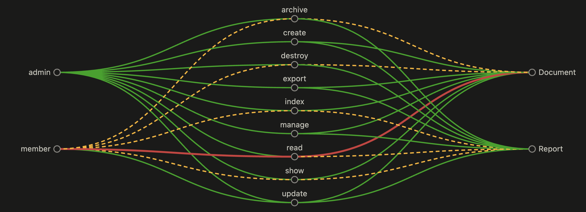

# ruby_ability_graph

[](https://rubygems.org/gems/ruby_ability_graph)
[](https://github.com/m1gd0n-dev/ruby-ability-graph/actions/workflows/ci.yml)
[](LICENSE.txt)

Want to know what your CanCanCan rules actually allow? `ruby_ability_graph` loads a Rails app's [CanCanCan](https://github.com/CanCanCommunity/cancancan) `Ability` class on its own and checks every role, action, and model combination it finds. You get a clear view of who can access what without booting the full app or following every conditional by hand.

Each result is marked `resolved` when the tool can capture its condition in a structured form, or `unsupported` when it cannot. Unsupported results include a reason and a source location. `scan` prints a table by default. It can also output versioned JSON, check a policy file, or create an interactive HTML graph.

Tested against four open-source Rails apps that use CanCanCan:

| App | Resolved |
|---|---|
| [Fat Free CRM](https://github.com/fatfreecrm/fat_free_crm) | 88.9% |
| [Dradis CE](https://github.com/dradis/dradis-ce) | 86.4% |
| [Consul](https://github.com/consul/consul) | 99.5% |
| [Solidus](https://github.com/solidusio/solidus) | 96.8% |

## Installation

```
gem install ruby_ability_graph
```

Or add it to your Gemfile:

```ruby
gem "ruby_ability_graph"
```

Requires Ruby >= 4.0 and a C compiler because `prism` compiles a native extension at install time. The Rails app you're scanning does not need to be on Ruby 4. Point `--ruby-bin` at the Ruby it uses, and the analysis subprocess will use that instead.

## Usage

### 1. Find out what your Ability class needs

Run `inspect` first. It reads `Ability#initialize` with [Prism](https://github.com/ruby/prism) and lists every method it calls on `user`. It does not run your app:

```
ruby-ability-graph inspect APP_PATH [--ability-file FILE] [--ability-class NAME]
```

```
Methods called on `user` in Ability#initialize:
  admin?
  id

Add a value for each method for every role that reaches it.
```

### 2. Write a roles file

Create `.ability_graph_roles.yml` in your app root. Give each role you want to scan stand-in values for the methods `inspect` found:

```yaml
admin:
  admin?: true
member:
  admin?: false
  id: 42
```

### 3. Scan

```
ruby-ability-graph scan APP_PATH [--roles-file FILE] [--ability-file FILE] [--ability-class NAME]
                                  [--require FILE]... | [--rails-boot [--rails-env ENV]]
                                  [--ruby-bin PATH] [--format table|json] [--policy-file FILE]
                                  [--html-report FILE]
```

This loads your `Ability` class in a subprocess and runs `can?` for each role, action, and model combination it finds.

By default, it prints a table and a coverage summary:

```
ROLE    ACTION  MODEL     ALLOWED  CONFIDENCE   CONDITION
admin   read    Document  true     resolved     -
member  read    Document  true     resolved     {"team_id" => 7}
member  update  Document  true     unsupported  -

2/3 resolved (66.7%)
```

Use `--format json` if you need the same data as structured, versioned JSON:

```json
{
  "schema_version": 1,
  "results": [
    { "role": "admin", "action": "read", "model": "Document", "allowed": true,
      "confidence": "resolved", "condition": null, "reasons": [], "sources": [] },
    { "role": "member", "action": "read", "model": "Document", "allowed": true,
      "confidence": "resolved", "condition": { "team_id": 7 }, "reasons": [], "sources": [] },
    { "role": "member", "action": "update", "model": "Document", "allowed": true,
      "confidence": "unsupported", "condition": null, "reasons": ["block_condition"],
      "sources": [{ "file": "app/models/ability.rb", "line": 12, "text": "can :update, Document do |doc| ... end" }] }
  ]
}
```

**Options:**

| Flag | Default | Purpose |
|---|---|---|
| `--roles-file FILE` | `APP_PATH/.ability_graph_roles.yml` | YAML file from step 2 |
| `--ability-file FILE` | `app/models/ability.rb` | Path to the `Ability` class, relative to `APP_PATH` |
| `--ability-class NAME` | `Ability` | Constant name to load, e.g. `Spree::Ability` for a namespaced/engine-provided one |
| `--require FILE` (repeatable) | none | Preload a file your `Ability` class references but doesn't require itself. Not compatible with `--rails-boot` |
| `--rails-boot [--rails-env ENV]` | off / `test` | Boot via the target's own `bin/rails runner` so Zeitwerk can resolve everything normally. No manual `--require` list needed. Not compatible with `--require` |
| `--ruby-bin PATH` | `ruby` (via `PATH`) | Ruby executable for the analysis subprocess, if the target app needs a different Ruby version than this gem runs under |
| `--format table\|json` | `table` | `table` for a terminal-friendly summary, `json` for the versioned schema above |
| `--policy-file FILE` | none | Run a policy check against the results (see below); path is relative to `APP_PATH` |
| `--html-report FILE` | none | Write an interactive HTML graph of the results (see below) to this path, relative to `APP_PATH` |

Note: `--rails-boot` runs the target's *entire* boot sequence, not just the `Ability` class. If the app needs a JS runtime, a database connection, or anything else during boot, it must be available in the environment running the scan. This is more likely to come up in a stripped-down CI container or sandbox than on a normal development machine. If full boot is heavy or fragile, requiring just what the `Ability` class needs is usually simpler.

### 4. Policy checks (optional)

Declare who's *supposed* to be able to do what, and let `scan` flag any role that can actually do more. The policy language is deliberately flat: `model` + `action` + `allowed_roles`, with no nested logic:

```yaml
# policy.yml
policies:
  - model: Payment
    action: read
    allowed_roles: [admin]
  - model: Document
    action: destroy
    allowed_roles: [admin, owner]
```

```
ruby-ability-graph scan APP_PATH --policy-file policy.yml
```

A violation is any `(role, action, model)` combination the scan found `allowed: true` for, where `role` isn't in that policy's `allowed_roles`. Violations are appended to the table (or the `"policy_violations"` key in JSON output), and `scan` exits `1` if any are found. This makes it useful as a CI gate. A clean policy check exits `0`.

Policy checks are only as reliable as the result's `confidence`. An `unsupported` violation means the role stand-in used in this scan was allowed. It does not prove that every user with that role is allowed, because the tool could not fully analyze the condition. Treat it as something to look into, not a confirmed policy failure.

### 5. HTML report (optional)

```
ruby-ability-graph scan APP_PATH --html-report report.html
```

Writes one self-contained HTML file with an interactive role → action → resource graph. The CSS and JavaScript are included in the file, so it works without a server or CDN.

Hover over a role to see what it can reach. Hover over an edge to see the condition and its confidence. An edge can represent several results: a role → action edge, for example, may cover more than one model. Its color shows how many of those results were resolved: green means all of them, a green-to-amber gradient means some of them, and dashed amber means none of them. An edge turns red if `--policy-file` finds a violation. The coverage count at the top matches the summary from the table.

The graph only includes `allowed: true` results. It is meant to make access paths easier to spot, not to show every denied request.



Use `--policy-file` to highlight violations in the graph as well as the table and JSON output. Open the report directly from disk in any browser. You do not need to serve it first.

## Security

`scan` executes code from `APP_PATH`. It loads your `Ability` class and anything that file requires in a subprocess, so only run it against apps you trust. `inspect` uses static analysis through Prism and does not execute the target app.

`--html-report` does not make network requests. It does include your role names, action names, model names, and raw condition values in the generated file. If that information is sensitive, keep the report private.

## License

AGPL-3.0-or-later.

This is a CLI/library for running against your own `Ability` class in CI or locally. It is not a network service your users interact with. AGPL's network-copyleft clause (§13) applies when you modify a program and offer that modified version to outside users over a network. Running this tool against your own codebase does not do that.
